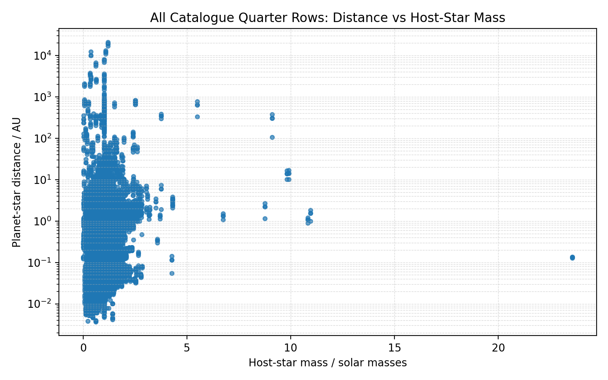
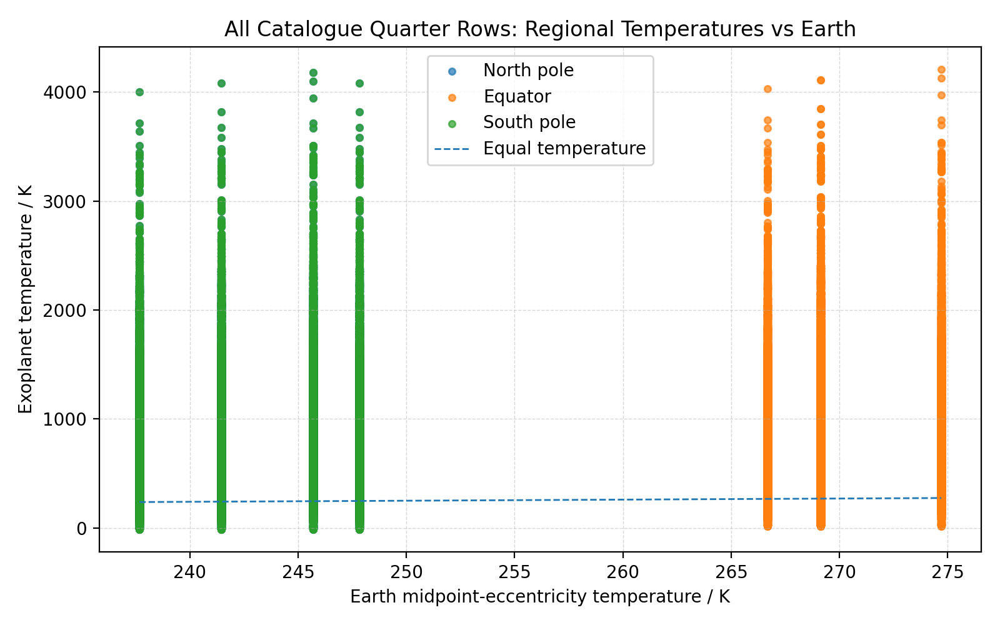
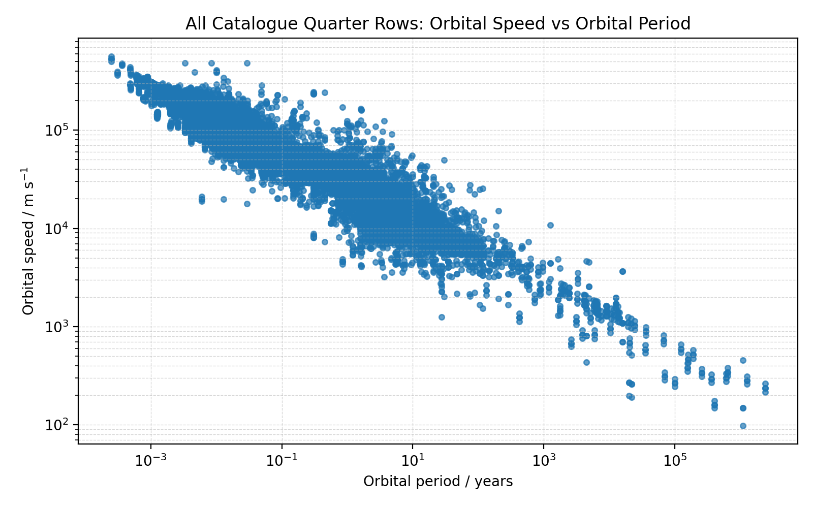

# Exoplanet orbital-temperature profiles

This project models an exoplanet's Keplerian orbit, orbital speed, and estimated
equilibrium temperature. It can animate any planet in a compatible CSV, sample a
complete orbital period, save an individual graph and CSV for every selected
planet, and overlay several planets for comparison.

> **Scientific scope:** this is an educational orbital/equilibrium-temperature
> model, not a climate model or a source of observed surface temperatures. It
> does not model an atmosphere, greenhouse warming, oceans, clouds, or heat
> capacity.

## The problem

Exoplanet catalogues contain orbital periods, scales, eccentricities, host-star
properties, and several competing literature solutions, but those columns do not
immediately show how one planet's distance, speed, and equilibrium temperature
change around an orbit. The project asks how far a transparent two-body model can
take that comparison, and which assumptions become dominant when catalogue
values are missing.

## The approach

The simulator resolves one usable solution per planet/host identity, derives a
consistent two-body period from the chosen scale and masses, samples the orbit
uniformly in elapsed time, and solves Kepler's equation at every sample. Vis-viva
provides speed and a redistributed black-body calculation provides equilibrium
temperature. The older catalogue-wide scripts separately compare the processed
quarter-orbit rows with matching Earth rows.

## What I found

The bundled 149,648 quarter rows reduce to 6,284 selectable planet/host
identities. The per-planet profiles recover the expected coupled behaviour:
periapsis is the closest, fastest, and hottest part of an eccentric orbit, while
the size of that variation grows with eccentricity. The catalogue-wide figures
also expose broad relationships between orbital period, speed, distance, host
mass, and the modelled temperatures.

Those plots are descriptive rather than a search for Earth analogues. Every
quarter row with a matching Earth phase is included, missing luminosities and
masses can fall back to strong defaults, and the repository does not contain the
original catalogue query or retrieval date. The most important finding is
therefore methodological: the orbit can be made internally consistent, but the
quality and provenance of the inputs still limit the scientific conclusion.

## Features

- Loads both NASA-style exoplanet columns and the bundled processed catalogue.
- Exposes 6,284 deduplicated planets from the bundled CSV for selection by number,
  name, host, or exact `planet @ host` label, preferring archival solutions with
  an independently constrained orbital scale and then the best period consistency.
- Samples each profile uniformly in elapsed orbital time from phase 0 through 1,
  including both endpoints to close the orbit.
- Saves global, north-pole, equator, and south-pole temperature curves plus
  planet-star distance for every selected/comparison planet.
- Compares global-temperature profiles on normalized orbital phase, so planets
  with different periods can share one graph.
- Animates one selected planet in a Tkinter window, including distance, speed,
  regional temperatures, axial tilt, and optional eccentricity limits.

## Requirements and installation

- Python 3.10 or newer
- Matplotlib 3.7 or newer
- Tkinter for the animation (usually included with Windows and macOS Python;
  some Linux distributions package it separately as `python3-tk`)

Create an environment and install the Python dependency:

```powershell
python -m venv .venv
.\.venv\Scripts\Activate.ps1
python -m pip install -r requirements.txt
```

On macOS/Linux, activate with `source .venv/bin/activate` instead.

## Quick start

Generate an Earth/Sun profile and open the animation:

```powershell
python SIMULATION_exoplanet_orbit_temperature.py
```

Search the bundled catalogue without opening the GUI:

```powershell
python SIMULATION_exoplanet_orbit_temperature.py exoplanet_orbital_quarter_data.csv --list-planets "Kepler-1988"
```

Select and animate a catalogue planet (its full-orbit CSV and PNG are generated
before the window opens):

```powershell
python SIMULATION_exoplanet_orbit_temperature.py exoplanet_orbital_quarter_data.csv --planet "Kepler-1988 b"
```

Generate and compare two complete profiles without opening the animation:

```powershell
python SIMULATION_exoplanet_orbit_temperature.py exoplanet_orbital_quarter_data.csv --planet "Kepler-1988 b" --compare "WASP-8 b" --no-gui
```

Repeat `--compare SELECTOR` to add more planets. A selector may be a global menu
number, an exact planet name, an exact `planet @ host` label, or a search string
that matches exactly one loaded planet.

## Selecting and running planets

If a CSV is supplied without `--choice` or `--planet`, the terminal shows every
loaded planet and asks for a number, exact name, or search. For the bundled
catalogue this is a long list, so `--planet`, `--choice`, or
`--list-planets [FILTER]` is usually more convenient. Useful options are:

| Option | Purpose |
| --- | --- |
| `--choice N` | Select the planet with global menu number `N`; mutually exclusive with `--planet`. |
| `--planet SELECTOR` | Select by name, host search, or `planet @ host`; mutually exclusive with `--choice`. |
| `--compare SELECTOR` | Add a planet to the comparison; repeat as needed. |
| `--list-planets [FILTER]` | List all planets or matching names/hosts, then exit. |
| `--profile-samples N` | Set samples per full orbit, including both endpoints (default `361`, minimum `3`). |
| `--output-dir PATH` | Change the profile output directory. |
| `--no-gui` | Generate files without opening Tkinter. |
| `--all-profiles` | Generate a CSV and graph for every deduplicated loaded planet. |
| `--orbit-seconds N` | Set the visual duration of one revolution (default `60`, minimum `0.1` seconds). |
| `--eccentricity-cycle-seconds N` | Set the visual min-max-min eccentricity cycle (default `30`, minimum `1` second). |
| `--duration N` | Close after a finite, non-negative number of real seconds (`0` runs continuously). |
| `--tilt DEGREES` | Override axial tilt with a finite value for every loaded row. |

A plain `--all-profiles` run creates 12,568 per-planet files for the bundled
6,284-planet catalogue and can take substantial time and disk space. A primary
planet plus at least one distinct comparison (two total planets) adds one
comparison PNG. Normal runs generate files only for the selected planet and
explicit comparisons.

Animation controls:

- `Space`: pause or resume
- `Esc`: close the window

## Profile outputs

The default directory is `orbital_temperature_profiles/`. For a selected planet,
the simulator creates:

| File | Contents |
| --- | --- |
| `NNNN_planet_temperature_profile.csv` | One row per sample: planet, host, phase, time, model/source periods, true anomaly, distance, eccentricity, speed, and four temperatures. |
| `NNNN_planet_temperature_profile.png` | Full-period regional/global temperature curves and the distance curve. |
| `temperature_profile_comparison_<choices>.png` | Selection-specific global-temperature overlay; two planets produce a name such as `..._0001-0002.png`, while very large sets use a count and short hash. |

The numeric prefix is the stable menu number within that loaded CSV and prevents
same-named files from colliding.

## Supported CSV fields

The loader accepts the following aliases. Units matter.

| Quantity | Accepted columns | Unit/behavior |
| --- | --- | --- |
| Planet | `pl_name`, `planet` | Falls back to a row label if absent. |
| Host | `hostname`, `host_star` | Falls back to `Unknown host`. |
| Period | `pl_orbper`, `period_days`, `orbital_period_years` | Source period: days for the first two, years for the last. Preserved as metadata while the dynamic model period is derived from scale and masses. |
| Semi-major axis | `pl_orbsmax`, `semi_major_axis_au` | AU; if missing, recovered from reference distance/phase or derived from period plus host and planet masses. |
| Eccentricity | `eccentricity_for_analysis`, `expected_eccentricity`, `pl_orbeccen`, `eccentricity` | Clamped to `0` through `0.95`; missing values become `0`. |
| Eccentricity limits | `eccentricity_min` + `eccentricity_max`, `e_min` + `e_max`, `pl_orbeccen_min` + `pl_orbeccen_max`, or `pl_orbeccenerr1` and/or `pl_orbeccenerr2` | Used for the plot envelope and accelerated animation cycle. |
| Host mass | `st_mass`, `host_mass_solar` | Solar masses; defaults to `1`. |
| Host luminosity | `st_lum_solar`, or logarithmic `st_lum` | `st_lum_solar` is in solar units; `st_lum` is `log10(L_star/L_sun)`. |
| Reference phase/radius | `orbit_fraction`, `current_distance_au` | Elapsed-time/mean-anomaly fraction modulo one (phase `0` is periapsis) and AU; together they can recover a missing semi-major axis. |
| Reference temperature | `exoplanet_global_temp_k`, `global_temp_k` with `current_distance_au` | Used to infer effective luminosity if luminosity is absent. |
| Planet mass | `planet_mass_earth`, `pl_bmasse`, or `pl_bmassj` | Earth or Jupiter masses; defaults to one Earth mass. |
| Albedo | `albedo`, `planet_albedo` | Defaults to `0.30`. |
| Axial tilt | `axial_tilt_deg`, `obliquity_deg`, `pl_obliq` | Degrees; defaults to `0`. |

A row is usable when both a positive period and semi-major axis are present or can
be derived. The bundled file repeats four quarter samples and often contains
several archival parameter solutions for the same world. For each case-insensitive
`(planet, host)` pair, the loader first prefers candidates whose scale comes from
an explicit semi-major axis or independent reference radius/phase. Among candidates
that also supply a source period, it minimizes the absolute log-ratio between that
period and the two-body period implied by scale and masses; first encounter is the
tie-breaker. Independently scaled rows without a source period rank next, followed
by period-only rows. This produces 6,284 selectable identities while preserving
their menu order. Alternative literature solutions are not exposed as separate
variants.

## Model and assumptions

For each evenly spaced elapsed-time sample, the simulator solves Kepler's equation
for eccentric anomaly, converts it to true anomaly, obtains radius on the ellipse,
and calculates speed with the vis-viva equation. The nominal eccentricity remains
fixed throughout a saved one-orbit profile.

After resolving semi-major axis, host mass, and planet mass, the simulator derives
an internally consistent two-body model period. If the input supplied a different
catalogue period, that value remains in `source_orbital_period_days` while the
derived value appears in `model_orbital_period_days` and controls profile time.

Global temperature uses a fully redistributed black-body equilibrium estimate:

```text
T = [ L (1 - A) / (16 pi sigma r^2) ]^(1/4)
```

where `L` is stellar luminosity, `A` is albedo, `sigma` is the Stefan-Boltzmann
constant, and `r` is instantaneous distance. The regional curves are a simple
latitude/season offset around that value; they are illustrative rather than a
physical circulation model.

If eccentricity bounds exist, an individual plot shades the global-temperature
range implied by those limits. The animation cycles between the limits on an
accelerated visual timescale controlled by `--eccentricity-cycle-seconds`; that
cycle is not a prediction of real eccentricity evolution.

## Catalogue-wide Earth comparison

Two older analysis entry points compare the already calculated quarter rows with
Earth's midpoint-eccentricity rows:

```powershell
# Compare every exoplanet quarter row
python main.py --exo exoplanet_orbital_quarter_data.csv --earth earth_orbital_quarter_data.csv --output results.csv

# Compare every row and include orbital-property deltas
python orbital_data_exoplanets_and_earth.py --exo exoplanet_orbital_quarter_data.csv --earth earth_orbital_quarter_data.csv --output results.csv
```

Both commands write `results.csv` and the same three fixed PNG names in the current
directory, so a later run overwrites the earlier outputs. Neither command applies
an Earth-similarity filter: every exoplanet row whose orbital quarter has a
matching Earth row is included in the CSV and eligible for the graphs. A graph
omits only points whose required axes are missing, non-finite, or invalid for its
axis (for example, non-positive distance, period, or speed on a logarithmic
axis). With the bundled data, all 149,648 quarter rows are comparable; these
represent the 6,284 deduplicated planet/host identities exposed by the simulator.

These committed images are catalogue-wide quarter-point plots, not the new smooth
per-planet profiles:







## Repository guide

| Path | Purpose |
| --- | --- |
| `SIMULATION_exoplanet_orbit_temperature.py` | Primary selector, profile generator, comparison plotter, and Tk animation. |
| `exoplanet_orbital_quarter_data.csv` | Bundled processed exoplanet quarter catalogue. |
| `earth_orbital_quarter_data.csv` | Earth at three eccentricity cases and four orbital quarters. |
| `main.py` | Unfiltered quarter-row Earth comparison. |
| `orbital_data_exoplanets_and_earth.py` | Unfiltered quarter-row Earth comparison with orbital-property deltas. |
| `tests/test_simulation.py` | Catalogue, selector, full-orbit closure, and output tests. |
| `tests/test_comparison.py` | Regression test proving non-Earth-like rows remain in the comparison. |

Run the tests with:

```powershell
python -m unittest discover -v
```

## Limitations and data provenance

- The bundled exoplanet temperatures are consistent with one solar luminosity,
  albedo `0.30`, full heat redistribution, and no greenhouse warming. They should
  not be read as measured temperatures or star-specific climate estimates.
- Missing stellar mass, planet mass, albedo, and tilt use the defaults documented
  above. Luminosity is first inferred from a reference temperature/distance when
  possible and otherwise defaults to one solar luminosity. These fallbacks can
  dominate the result.
- Most bundled planet names have several archival parameter solutions. Choosing
  independently constrained scale before period consistency avoids circularly
  validating period-derived scales, but still discards the uncertainty and
  provenance of other solutions.
- For processed rows without an explicit semi-major axis, reference distance and
  phase define orbital scale when available; otherwise period and component masses
  supply the fallback. A conflicting source period is retained as metadata rather
  than used to drive an inconsistent orbit.
- Comparisons use normalized phase, not simultaneous calendar time.
- The repository does not include the original catalogue query, retrieval date, or
  a reproducible raw-data generator, so the bundled dataset's provenance cannot be
  reconstructed from this checkout alone.
- No project license file is currently included.
